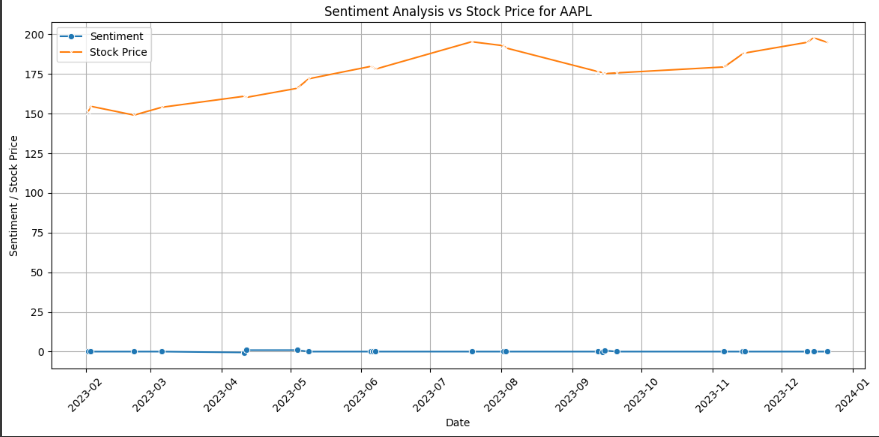
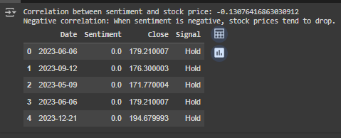

# Stock Sentiment Analysis based on Reddit Discussions

## Overview

This project performs sentiment analysis on Reddit discussions from the `r/wallstreetbets` subreddit to analyze stock market trends and stock-specific discussions. It extracts sentiment polarity (positive, negative, neutral) and correlates it with stock price data fetched from Yahoo Finance. 

The goal is to visualize trends in sentiment, analyze how sentiment correlates with stock price changes, and provide actionable insights based on social media discussions.

## Features

- **Reddit Data Scraping**: Scrape Reddit posts discussing specific stocks using the PRAW library.
- **Sentiment Analysis**: Perform sentiment analysis using VADER to gauge overall mood (positive, negative, neutral) for stock-related discussions.
- **Stock Price Data**: Fetch historical stock prices using Yahoo Finance (via `yfinance`).
- **Data Visualization**: Visualize the correlation between sentiment trends and stock prices over time.
- **Insights**: Generate insights on how sentiment influences stock price movements and provide potential buy/sell signals.

## Getting Started

### Prerequisites

Before you begin, ensure you have the following installed:

- Python 3.x
- Reddit API credentials (client ID, client secret, user agent)
- Required Python libraries (listed in `requirements.txt`)

### Installation

1. **Clone the Repository:**
   git clone https://github.com/yourusername/stock-sentiment-analysis.git
   cd stock-sentiment-analysis

2.**Install Dependencies:**
  pip install -r requirements.txt

3.Set up Reddit API:
  Visit Reddit Apps.
  Create an app and get your client_id, client_secret, and user_agent.
  Add these credentials to the stock_sentiment_analysis.py file.
  Install all required libraries from the requirements.txt file:

### Running the Code
1.**Run the Python Script:**
  python stock_sentiment_analysis.py

The script will:

2.**Scrape data from Reddit**
  Perform sentiment analysis on the scraped data.
  Fetch historical stock prices for the relevant stock symbol.
  Generate visualizations comparing sentiment trends with stock price movements.

3.**Output**
A plot visualizing sentiment polarity vs stock price over time.
Data saved as a CSV file (data/stock_sentiment_output.csv).

### File Structure

├── data/
│   └── stock_sentiment_output.csv      # Output data with sentiment and stock price
├── stock_sentiment_analysis.py         # Main Python script
├── requirements.txt                    # List of dependencies
└── README.md                           # Project documentation

### Usage
Modify the variables in the script such as subreddit_name, search_term, and ticker to analyze different stocks and Reddit discussions.
The start_date and end_date can be adjusted for fetching stock data over different time ranges.

### Example

**If you run the script with the following parameters:**

  subreddit_name = 'wallstreetbets'
  search_term = 'AAPL'
  ticker = 'AAPL'
  start_date = '2023-01-01'
  end_date = '2023-12-31'

### result 

## Screenshot

The script will scrape posts mentioning Apple (AAPL) from the r/wallstreetbets subreddit, analyze sentiment, and visualize how it correlates with AAPL stock price movements during 2023.

### Dependencies

praw - Python Reddit API Wrapper for scraping Reddit data.
yfinance - Yahoo Finance API for fetching stock data.
pandas - Data manipulation and analysis.
matplotlib and seaborn - Visualization libraries.
vaderSentiment - Sentiment analysis using the VADER model.

**Install all dependencies using:**

 pip install -r requirements.txt

### Contributing

Feel free to fork the repository, make improvements, and submit a pull request. Contributions are welcome!
